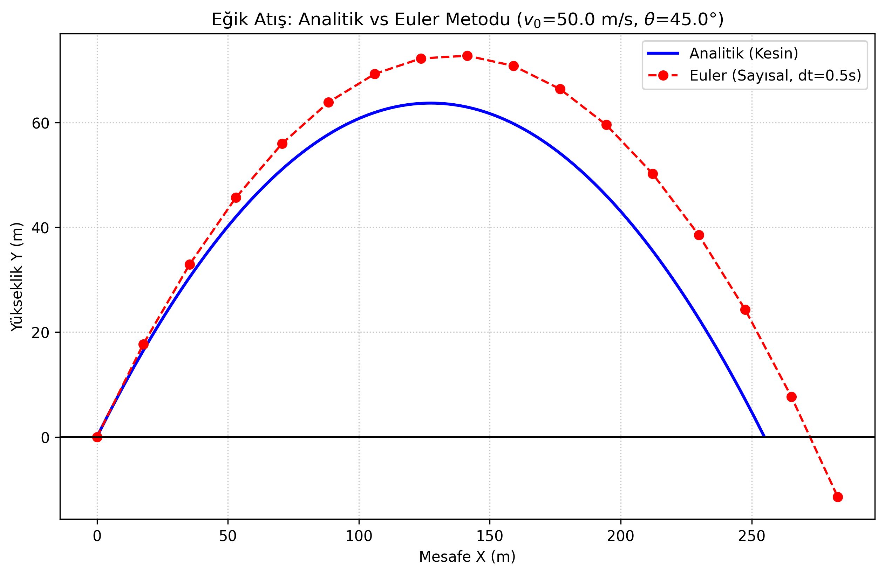

# Project 01: Projectile Motion

## Objective
To investigate projectile motion by comparing exact analytical solutions with numerical integration methods. This project serves as the foundational step in establishing a scientific computing workflow.

## Physical Model
The system consists of a point mass $m$ launched in a 2D plane. The projectile is modeled under uniform gravitational acceleration. For this baseline simulation, air resistance (drag) and the Earth's curvature are neglected.

## Theory
From Newton's Second Law, the only force acting on the particle is gravity in the negative y-direction. 

The equations of motion are derived as follows:
$$F_x = 0 \implies a_x = 0$$
$$F_y = -mg \implies a_y = -g$$

Integrating acceleration with respect to time yields the analytical position functions for any given time $t$, initial velocity $v_0$, and launch angle $\theta$:
$$x(t) = x_0 + v_0\cos(\theta)t$$
$$y(t) = y_0 + v_0\sin(\theta)t - \frac{1}{2}gt^2$$

## Numerical Method
The trajectory is first calculated analytically to establish a ground truth, and then simulated numerically using the **Forward Euler integration** method. 

Time is discretized into small steps of size $\Delta t$. The state of the system at step $i+1$ is calculated based on the state at step $i$:
$$v_{x, i+1} = v_{x, i}$$
$$v_{y, i+1} = v_{y, i} - g \Delta t$$
$$x_{i+1} = x_i + v_{x, i} \Delta t$$
$$y_{i+1} = y_i + v_{y, i} \Delta t$$

## Results
The Python simulation (`python/simulation.py`) generates a trajectory plot comparing the exact analytical path with the numerical Euler approximation.

## Error Analysis
The numerical solution is compared against the analytical solution for different time steps ($\Delta t$). The Forward Euler method is a first-order numerical procedure, meaning its global truncation error is proportional to the step size, $\mathcal{O}(\Delta t)$. 

Because the Euler method assumes the velocity remains constant over the entire interval $\Delta t$, it systematically overestimates the position, leading to an artificially higher peak and longer range. Reducing $\Delta t$ increases accuracy but significantly increases computational cost.

## Conclusion
While the Forward Euler method is simple to implement and conceptually useful, it lacks the numerical stability and accuracy required for precise, long-term physical simulations. To simulate chaotic or long-duration systems efficiently, higher-order methods (such as Runge-Kutta) will be required in future projects.
